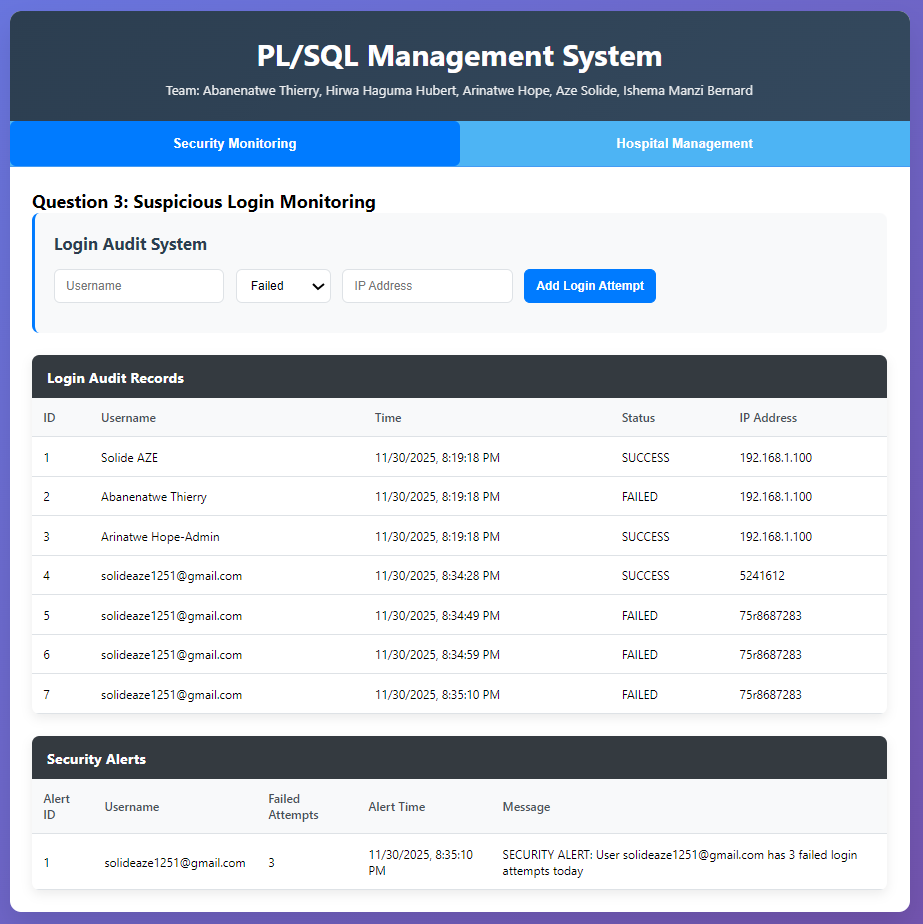
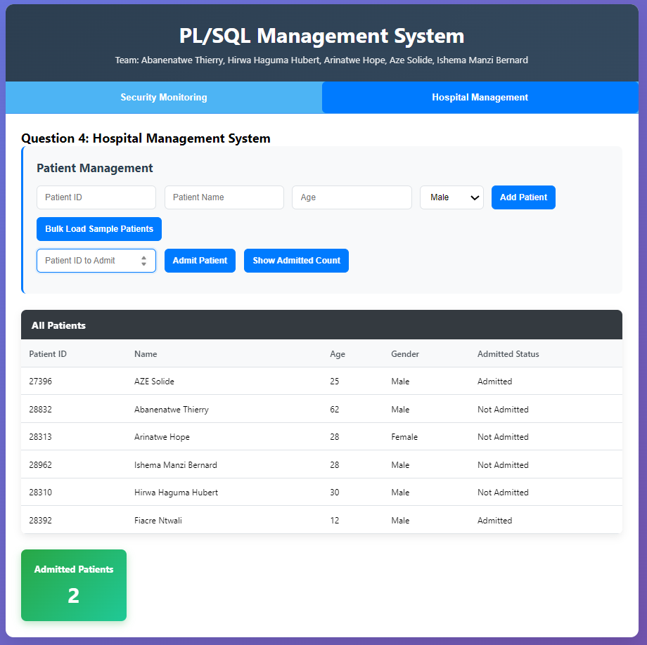

## Team Members(Names -> ID -> Username)
| 1. Abanenatwe Thierry         28832         (@AThierry8)   |
| 2. Hirwa Haguma Hubert        28310         (@hirhubert07) |
| 3. Arinatwe Hope              28313         (Arina915)     |
| 4. Aze Solide                 27396         (@Llego-250)   |
| 5. Ishema Manzi Bernard       28962         (Ishema-50)    |
 ============================================================

## Question 3: Suspicious Login Monitoring (Advanced Triggers)
Overview: The goal was to monitor user logins and issue an immediate security alert if any user failed to log in more than two times in the same day.

Implementation:

Tables Created: LOGIN_AUDIT (to track all attempts) and SECURITY_ALERTS (to store policy violations).
Solution: A single AFTER INSERT trigger (trg_CheckSuspiciousLogin) was created on the LOGIN_AUDIT table.


Logic: The trigger checked if the inserted record's status was 'FAILED'. If so, it performed a COUNT(*) query on LOGIN_AUDIT for the same user on the current day (TRUNC(SYSTIMESTAMP)).
Alerting: If the count was ≥3, the trigger, operating under PRAGMA AUTONOMOUS_TRANSACTION, inserted a new record into SECURITY_ALERTS and executed an independent COMMIT.
Optional: A second trigger was outlined to demonstrate how to use UTL_MAIL to send an external email notification whenever a record was inserted into SECURITY_ALERTS. 


## Question 4: Hospital Management (Bulk Processing)
Overview: The requirement was to design a package for efficient patient management, utilizing collections and bulk processing for high-volume data operations.

Implementation:

Tables Created: PATIENTS and DOCTORS.


Package Created: hospital_mgmt_pkg.
Bulk Collection: A custom patient_tbl collection type was defined (a nested table of a patient_rec record type) to hold multiple patient records in memory.
Procedures/Functions:
bulk_load_patients: Used the FORALL statement to insert all records from the input collection (p_patients_list) into the PATIENTS table with a single context switch, ensuring optimal performance.
admit_patient: Updated the admitted_status for a single patient.
count_admitted: A function to return the total number of admitted patients.
show_all_patients: A function that returns a SYS_REFCURSOR, allowing the calling application to fetch and display the full patient list efficiently.


# PL/SQL Management System Interface

This web interface demonstrates the functionality of the PL/SQL queries and triggers implemented in Questions 3 and 4.

## Features

### Question 3: Security Monitoring
- **Login Audit System**: Track login attempts (SUCCESS/FAILED)
- **Suspicious Login Detection**: Automatically triggers security alerts after 3+ failed attempts
- **Real-time Alerts**: Visual notifications for security violations
- **Data Tables**: View all login attempts and security alerts

### Question 4: Hospital Management
- **Patient Management**: Add individual patients or bulk load sample data
- **Admission System**: Admit patients and track admission status
- **Statistics**: Real-time count of admitted patients
- **Data Display**: View all patients with their current status

## How to Use

1. Open `index.html` in a web browser
2. Use the tabs to switch between Security Monitoring and Hospital Management
3. Test the functionality:
   - **Security Tab**: Add login attempts and observe automatic alert generation
   - **Hospital Tab**: Add patients, admit them, and view statistics

## Simulated PL/SQL Operations

### Security Triggers
- Simulates the `trg_CheckSuspiciousLogin` trigger
- Automatically creates security alerts when failed login threshold is reached
- Demonstrates autonomous transaction behavior

### Hospital Package Functions
- `bulk_load_patients`: Simulated bulk insert operations
- `admit_patient`: Update patient admission status
- `count_admitted`: Count admitted patients
- `show_all_patients`: Display all patient records

### Interface Screenshots



## Project Structure
```
group_assignment-PL-SQL-Triggles/
├── question3/                              # Question 3: Security Monitoring
│   ├── schema/
│   │   └── create_tables.sql               # LOGIN_AUDIT & SECURITY_ALERTS tables
│   ├── triggers/
│   │   └── check_suspicious_login.sql      # Suspicious login trigger
│   └── test/
│       └── check_activity.sql              # Test scripts
├── question4/                              # Question 4: Hospital Management
│   ├── schema/
│   │   └── create_tables.sql               # PATIENTS & DOCTORS tables
│   ├── packages/
│   │   ├── hospital_mgmt.sql               # Package specification
│   │   └── hospital_mgmt_body.sql          # Package body
│   └── test/
│       └── test_package.sql                # Package test scripts
├── interface/                              # Web Interface Demo
│   ├── index.html                          # Main interface
│   ├── styles.css                          # Styling and layout
│   ├── script.js                           # JavaScript functionality
│   ├── screenshots/                        # Implementation screenshots
│   └── README.md                           # Interface documentation
├── screenshots/                            # Original screenshots
│   ├── Interface/                          # Interface screenshots
│   └── *.png, *.jpg                        # Implementation screenshots
└── README.md                               # This documentation
```